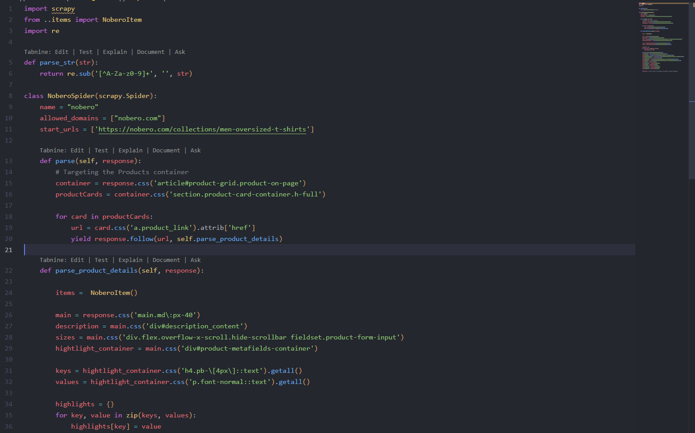
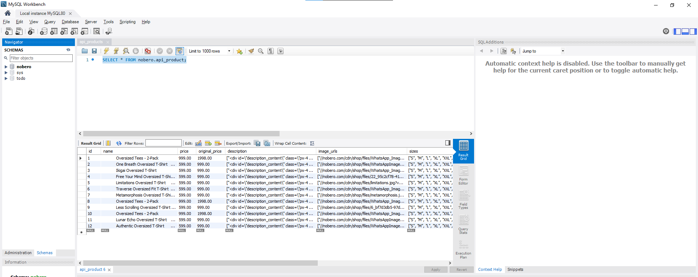
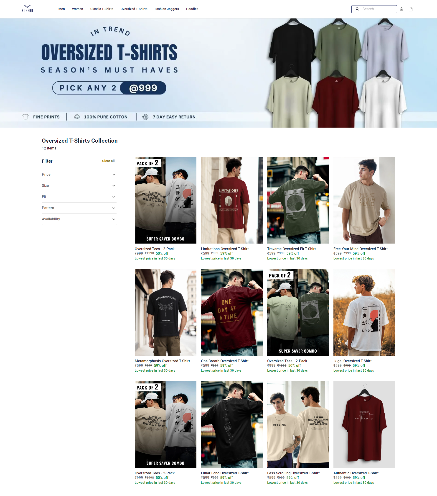
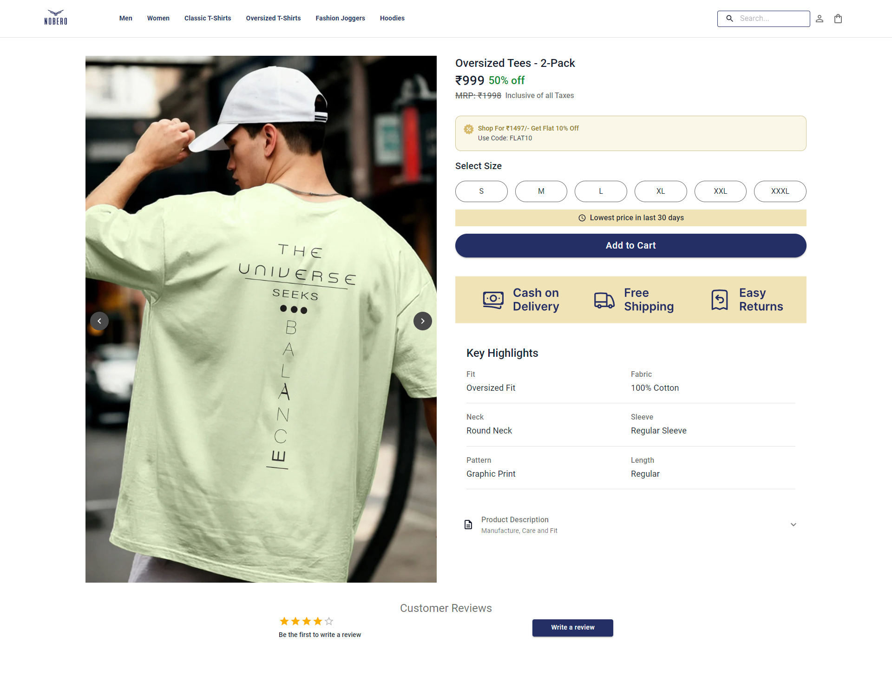

# Nobero Assignment

## Web Scrapping and Creating API

-   I have successfully scraped the product data from Nobero.com as per the assignment requirements and stored the data in a MySQL database. This allows for easy access through APIs at a later stage
-   I have developed a backend using Django and Django REST Framework to provide APIs for the scraped data. These APIs enable the frontend to display the products effectively.

## Frontend

-   As per the assignment, I created an exact replica of the Nobero website and integrated the API to enable real-time data fetching through the backend
-   I have attached screenshots for your reference to provide a clearer view before you run the actual code.

